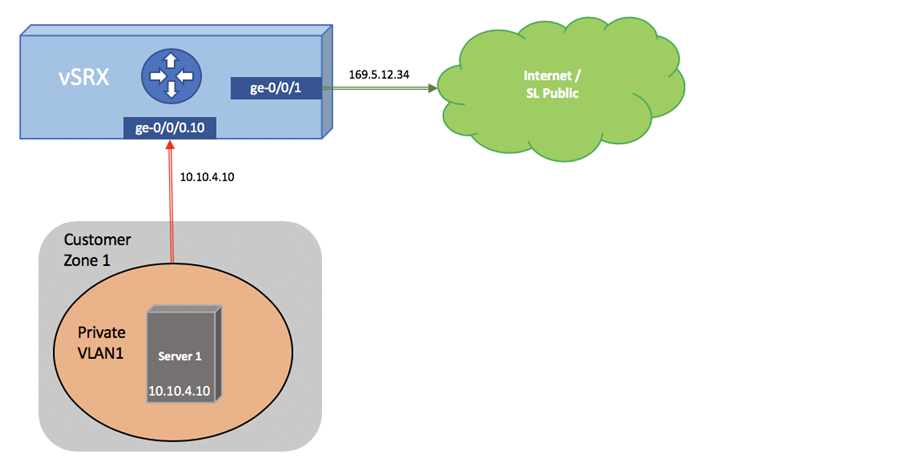

---

copyright:
  years: 2024
lastupdated: "2024-01-22"

keywords: nat, working, gateways, nodes

subcollection: vfsa

---

{{site.data.keyword.attribute-definition-list}}

# Working with sNAT
{: #working-with-snat}
{: help}
{: support}

This topic provides a sample configuration for sNAT on a vFSA appliance. With this configuration, a private node routed behind the gateway can communicate with the outside world.
{: shortdesc}

{: caption="Sample topology" caption-side="bottom"}


```sh
from-zone CUSTOMER-PRIVATE to-zone SL-PUBLIC {
   policy SNAT {
       match {
           source-address any;
           destination-address any;
           application any;
       }
       then {
           permit;
       }
   }
}

nat {
   source {
       rule-set rs1 {
           from zone CUSTOMER-PRIVATE;
           to zone SL-PUBLIC;
           rule r1 {
               match {
                   source-address 0.0.0.0/0;
                   destination-address 0.0.0.0/0;
               }
               then {
                   source-nat {
                       interface;
                   }
               }
           }
       }
   }
}
```

To configure NAT for the {{site.data.keyword.vfsa_full}}, refer to this [configuration guide](https://www.juniper.net/documentation/en_US/junos/information-products/pathway-pages/security/security-nat.pdf){: external} on the Juniper website.
