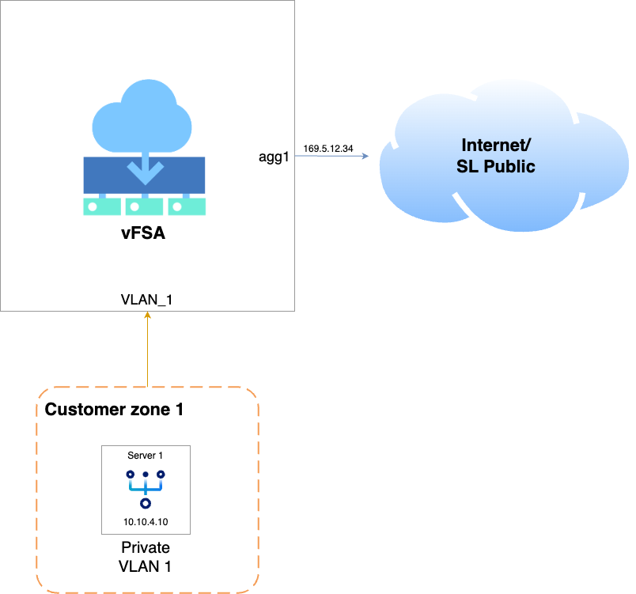

---

copyright:
  years: 2024
lastupdated: "2024-01-22"

keywords: nat, working, gateways, nodes

subcollection: vfsa

---

{{site.data.keyword.attribute-definition-list}}

# Working with sNAT
{: #working-with-snat}
{: help}
{: support}

This topic provides a sample configuration for sNAT on a vFSA appliance. With this configuration, a private node routed behind the gateway can communicate with the outside world.
{: shortdesc}

{: caption="Sample topology" caption-side="bottom"}


```sh
# sNAT configuration example

#enable central-nat
config system settings
    set central-nat enable
end

#set up sNAT
config firewall central-snat-map
    edit 1
        set srcintf "VLAN_1"
        set dstintf "agg1"
        set orig-addr "all"
        set dst-addr "all"
    next
end

#set up firewall to specify allowed service
config firewall policy
    edit 10
        set srcintf "VLAN_1"
        set dstintf "agg1"
        set action accept
        set srcaddr "all"
        set dstaddr "all"
        set schedule "always"
        set service "PING" "HTTPS"
    next
end
```

To configure NAT for the {{site.data.keyword.vfsa_full}}, refer to this [configuration guide](https://docs.fortinet.com/document/fortigate/7.4.3/administration-guide/421028/central-snat){: external} on the Fortinet website.
