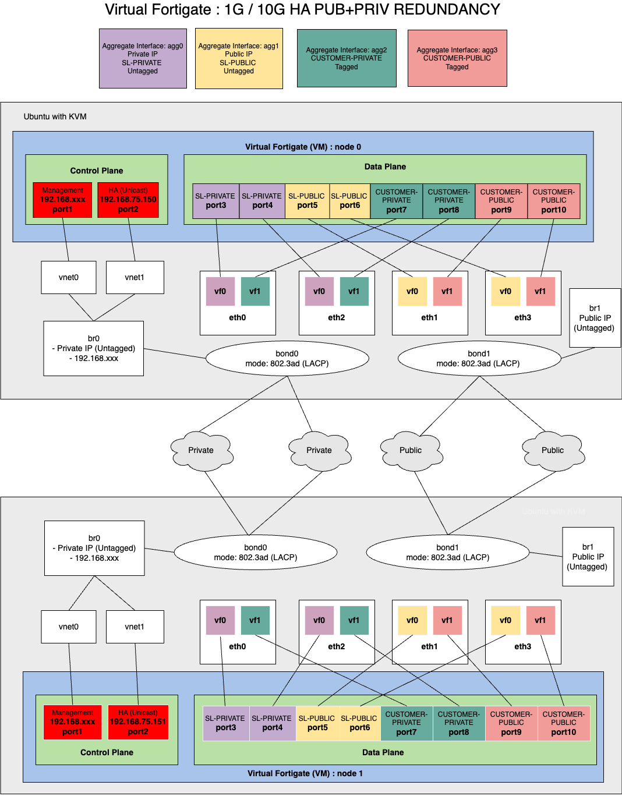

---

copyright:
  years: 2024
lastupdated: "2024-08-02"

keywords: working, routing, static, default, creating, ospf, bgp

subcollection: vfsa

---

{{site.data.keyword.attribute-definition-list}}

# Understanding the vFSA default configuration
{: #understanding-the-vfsa-default-configuration}

The Ubuntu hypervisor running KVM uses SR-IOV network interfaces to optimize network performance. These interfaces are connected directly to the vFSA interfaces discussed below, except where noted.

{{site.data.keyword.vfsa_full}} devices come with following default configuration:
{: shortdesc}

* SSH and Ping are permitted on both vFSA public and private gateway IP addresses.
* FortiGate Web Console (GUI) is permitted on HTTPS port 443 for both public and private gateway IP addresses.
* Entries for the IBM service networks are predefined under `Policy & Objects > Addresses`. The following `Address Groups` and `IP Range/Subnet` entries represent these service networks:

   * `SERVICE`
   * `SL1` .. `SL20`
   * `SL-PRIVATE`
   * `SL-PUBLIC`

* Entries for the local interfaces: `SL-PRIV_MGMT` and `SL-PUB_MGMT` are predefined.
* Access from the zone `SL-PRIVATE` to all services is provided by IBM and `Address Group` `SERVICE` is permitted.
* All other network accesses are denied.

For high availability vFSA configurations several aggregate interface groups are defined to support redundancy. The following table illustrates these groups:

| Aggregate Interface   |  Aggregate Interface function      |
| :---          |    :---         |
| agg0   |  Aggregate interface for private control plane |
| agg1   |  Aggregate interface for public control plane |
| agg2   |  Aggregate interface for private data plane |
| agg3   |  Aggregate interface for public data plane
{: caption="Table 1. Aggregate Interfaces " caption-side="bottom"}

For standalone vFSA configurations several aggregate interface groups are defined to support redundancy. The following table illustrates these groups:

| Aggregate Interface   |  Aggregate Interface function      |
| :---          |    :---         |
| agg0   |  Aggregate interface for private control and data plane |
| agg1   |  Aggregate interface for public control and data plane
{: caption="Table 2. Aggregate Interfaces " caption-side="bottom"}

Priority in the aggregate interfaces decides which vFSA node is active. By default, node 0 is active for both control plane and data plane.

## Network topology for highly available vFSA clusters
{: #vfsa-ha-interfaces}

The following diagram illustrates the network interface topology on a highly available vFSA cluster. Redundancy is illustrated at each logical layer of the configuration. The bare-metal server has a 4 port network interface card that is connected to 2 private and 2 public switches, configured with LACP bonding to the Ubuntu host. These bonds are used for the control plane interfaces. Even though the SRIOV virtual functions bypass the bonds, they have redundant interfaces on each physical function to ensure redundancy on the data plane. The vFSA VM configuration uses aggregate interfaces to utilize this VF redundancy.

{: caption="Figure 1. Highly available vFSA interfaces" caption-side="bottom"}

The Ubuntu hypervisor running KVM uses SR-IOV network interfaces to optimize network performance. These interfaces are connected directly to the vFSA interfaces discussed previously, except where noted.
{: note}

## Default configuration of a sample 1G standalone public and private vFSA gateway
{: #default-configuration-of-a-sample-standalone-vfsa-gateway}

Some of the following output has been removed or obfuscated.
{: note}

```sh
vfsa # show system interface
config system interface
    edit "port1"
        set vdom "root"
        set ip 192.168.76.30 255.255.255.192
        set allowaccess ping https ssh fgfm
        set type physical
        set snmp-index 1
    next
    edit "port2"
        set vdom "root"
        set type physical
        set snmp-index 2
        set macaddr 2e:b8:55:4f:50:8b
    next
    edit "port3"
        set vdom "root"
        set type physical
        set snmp-index 3
        set macaddr 02:66:80:dd:47:cd
    next
    edit "port4"
        set vdom "root"
        set type physical
        set snmp-index 4
        set macaddr ee:80:ef:71:f1:0f
    next
    edit "port5"
        set vdom "root"
        set type physical
        set snmp-index 5
        set macaddr b6:af:ad:d4:4c:31
    next
    edit "naf.root"
        set vdom "root"
        set type tunnel
        set src-check disable
        set snmp-index 6
    next
    edit "l2t.root"
        set vdom "root"
        set type tunnel
        set snmp-index 7
    next
    edit "ssl.root"
        set vdom "root"
        set type tunnel
        set alias "SSL VPN interface"
        set snmp-index 8
    next
    edit "fortilink"
        set vdom "root"
        set fortilink enable
        set ip 10.255.1.1 255.255.255.0
        set allowaccess ping fabric
        set type aggregate
        set lldp-reception enable
        set lldp-transmission enable
        set snmp-index 9
    next
    edit "agg0"
        set vdom "root"
        set ip *** 255.255.255.192
        set allowaccess ping https ssh fgfm
        set type aggregate
        set member "port2" "port3"
        set lldp-transmission enable
        set snmp-index 10
        set lacp-mode static
    next
    edit "agg1"
        set vdom "root"
        set ip *** 255.255.255.248
        set allowaccess https fgfm
        set type aggregate
        set member "port4" "port5"
        set lldp-transmission enable
        set snmp-index 11
        set lacp-mode static
    next
end

vfsa # show firewall address
config firewall address
    edit "none"
        set uuid a89ac9d0-9dcb-51ee-7dde-c26e289b1cd2
        set subnet 0.0.0.0 255.255.255.255
    next
    ************
    ********
    ****
    edit "SL_PRIV_MGMT"
        set uuid 9ed20dda-9dcd-51ee-1d35-1cae69bde1e2
        set subnet *** 255.255.255.255
    next
    edit "SL-PRIVATE"
        set uuid a1fc8486-9dcd-51ee-62c0-5f18bad5f455
        set subnet 10.0.0.0 255.0.0.0
    next
    edit "SL_PUB_MGMT"
        set uuid ac1f45d4-9dcd-51ee-86b5-04f9094f2bde
        set subnet *** 255.255.255.255
    next
    edit "SL1"
        set uuid af4a91e6-9dcd-51ee-4344-f14ee24e6039
        set subnet 10.0.64.0 255.255.224.0
    next
    edit "SL2"
        set uuid b27488e0-9dcd-51ee-67dd-ac7dd4ddc2d5
        set subnet 10.1.128.0 255.255.224.0
    next
    edit "SL3"
        set uuid b59e7bca-9dcd-51ee-b1fa-4d39e5f8b8d0
        set subnet 10.0.86.0 255.255.255.0
    next
    edit "SL4"
        set uuid b8c868c4-9dcd-51ee-33aa-200bb85b9fea
        set subnet 10.2.128.0 255.255.240.0
    next
    edit "SL5"
        set uuid bbf269f0-9dcd-51ee-7dd0-cc96456fb4f2
        set subnet 10.1.176.0 255.255.240.0
    next
    edit "SL6"
        set uuid bf1c61e4-9dcd-51ee-4d50-1f988ec9affd
        set subnet 10.1.64.0 255.255.224.0
    next
    edit "SL7"
        set uuid c2464e20-9dcd-51ee-9555-e6e4e8037194
        set subnet 10.1.96.0 255.255.224.0
    next
    edit "SL8"
        set uuid c5704830-9dcd-51ee-dbde-3d4711dc00a5
        set subnet 10.1.192.0 255.255.240.0
    next
    edit "SL9"
        set uuid c89a501e-9dcd-51ee-d640-5d41dc47da64
        set subnet 10.1.160.0 255.255.240.0
    next
    edit "SL10"
        set uuid cbc4508c-9dcd-51ee-879e-c3f35255d1db
        set subnet 10.2.32.0 255.255.240.0
    next
    edit "SL11"
        set uuid ceed7680-9dcd-51ee-7b61-e5ef890e7a78
        set subnet 10.2.64.0 255.255.240.0
    next
    edit "SL12"
        set uuid d2177482-9dcd-51ee-a342-ba90a2b49c60
        set subnet 10.2.112.0 255.255.240.0
    next
    edit "SL13"
        set uuid d541739c-9dcd-51ee-e0cd-bbe2939250fc
        set subnet 10.2.160.0 255.255.240.0
    next
    edit "SL14"
        set uuid d86b88dc-9dcd-51ee-6ecb-bb94c5d334f0
        set subnet 10.1.208.0 255.255.240.0
    next
    edit "SL15"
        set uuid db95a916-9dcd-51ee-aec4-47ab0be0f7a6
        set subnet 10.2.80.0 255.255.240.0
    next
    edit "SL16"
        set uuid debfb726-9dcd-51ee-c9ca-610f71f39cbf
        set subnet 10.2.144.0 255.255.240.0
    next
    edit "SL17"
        set uuid e1e9941c-9dcd-51ee-4a13-8d65a3459745
        set subnet 10.2.48.0 255.255.240.0
    next
    edit "SL18"
        set uuid e5139462-9dcd-51ee-cb99-107be9ffe5a3
        set subnet 10.2.176.0 255.255.240.0
    next
    edit "SL19"
        set uuid e83d8792-9dcd-51ee-f412-c3b4f5340d71
        set subnet 10.3.64.0 255.255.240.0
    next
    edit "SL20"
        set uuid eb6729a0-9dcd-51ee-ffc7-afc7ded79093
        set subnet 10.3.80.0 255.255.240.0
    next
end

vfsa # show firewall addrgrp
config firewall addrgrp
    **************
    *********
    ****
    edit "SERVICE"
        set uuid ee910330-9dcd-51ee-8158-c01189d357ba
        set member "SL1" "SL2" "SL3" "SL4" "SL5" "SL6" "SL7" "SL8" "SL9" "SL10" "SL11" "SL12" "SL13" "SL14" "SL15" "SL16" "SL17" "SL18" "SL19" "SL20"
    next
end

vfsa # show firewall policy
config firewall policy
    edit 1
        set uuid a5268f1c-9dcd-51ee-131c-950b12f291d5
        set srcintf "agg0"
        set dstintf "agg0"
        set action accept
        set srcaddr "SL-PRIVATE"
        set dstaddr "SL_PRIV_MGMT"
        set schedule "always"
        set service "ALL"
    next
    edit 2
        set uuid f1bf0c96-9dcd-51ee-d1d4-d00313f56450
        set srcintf "agg0"
        set dstintf "agg0"
        set action accept
        set srcaddr "SL-PRIVATE"
        set dstaddr "SERVICE"
        set schedule "always"
        set service "ALL"
    next
    edit 3
        set uuid f8b76a66-9dcd-51ee-019d-4172c81db705
        set srcintf "agg1"
        set dstintf "agg1"
        set action accept
        set srcaddr "all"
        set dstaddr "SL_PUB_MGMT"
        set schedule "always"
        set service "PING" "HTTPS"
    next
end

vfsa # show router static
config router static
    edit 1
        set gateway ***
        set device "agg1"
    next
    edit 2
        set dst 10.0.0.0 255.0.0.0
        set gateway ***
        set device "agg0"
    next
    edit 3
        set dst 161.26.0.0 255.255.0.0
        set gateway ***
        set device "agg0"
    next
    edit 4
        set dst 166.9.0.0 255.255.0.0
        set gateway ***
        set device "agg0"
    next
    edit 5
        set dst 166.8.0.0 255.252.0.0
        set gateway ***
        set device "agg0"
    next
end
```

The following table illustrates network interface definitions for the previous configuration:

| Interface name   | Interface  function   | Aggregate interface |
| :---       |    :---     |    :---     |
| port1      | Private Management interface connected to vnet0  | None |
| port2      | Gigabit ethernet interface for SL-PRIVATE transit VLAN and Customer VLAN | agg0 |
| port3      | Gigabit ethernet interface for SL-PRIVATE transit VLAN and Customer VLAN | agg0 |
| port4      | Gigabit ethernet interface for SL-PUBLIC transit VLAN and Customer VLAN | agg1 |
| port5      | Gigabit ethernet interface for SL-PUBLIC transit VLAN and Customer VLAN | agg1 |
{: caption="Table 3: Configuration information" caption-side="bottom"}

## Default Configuration of a sample 10G HA Public and Private vFSA Gateway
{: #default-configuration-of-a-sample-highly-available-ha-vfsa-gateway}

Note: Some output below has been removed or obfuscated.
{: note}

```sh
vfsa # show system interface
config system interface
    edit "port1"
        set vdom "root"
        set management-ip 192.168.75.31 255.255.255.192
        set allowaccess ping ssh snmp
        set type physical
        set snmp-index 1
    next
    edit "port2"
        set ip 192.168.75.151 255.255.255.240
        set allowaccess ping
        set type physical
        set snmp-index 2
    next
    edit "port3"
        set vdom "root"
        set type physical
        set snmp-index 3
    next
    edit "port4"
        set vdom "root"
        set type physical
        set snmp-index 4
    next
    edit "port5"
        set vdom "root"
        set type physical
        set snmp-index 5
    next
    edit "port6"
        set vdom "root"
        set type physical
        set snmp-index 6
    next
    edit "port7"
        set vdom "root"
        set type physical
        set snmp-index 7
    next
    edit "port8"
        set vdom "root"
        set type physical
        set snmp-index 8
    next
    edit "port9"
        set vdom "root"
        set type physical
        set snmp-index 9
    next
    edit "port10"
        set vdom "root"
        set type physical
        set snmp-index 10
    next
    edit "naf.root"
        set vdom "root"
        set type tunnel
        set src-check disable
        set snmp-index 11
    next
    edit "l2t.root"
        set vdom "root"
        set type tunnel
        set snmp-index 12
    next
    edit "ssl.root"
        set vdom "root"
        set type tunnel
        set alias "SSL VPN interface"
        set snmp-index 13
    next
    edit "fortilink"
        set vdom "root"
        set fortilink enable
        set ip 10.255.1.1 255.255.255.0
        set allowaccess ping fabric
        set type aggregate
        set lldp-reception enable
        set lldp-transmission enable
        set snmp-index 14
    next
    edit "agg1"
        set vdom "root"
        set ip *** 255.255.255.248
        set allowaccess https fgfm
        set type aggregate
        set member "port5" "port6"
        set lldp-transmission enable
        set snmp-index 16
        set lacp-mode static
    next
    edit "agg0"
        set vdom "root"
        set ip *** 255.255.255.192
        set allowaccess ping https ssh fgfm
        set type aggregate
        set member "port3" "port4"
        set lldp-transmission enable
        set snmp-index 15
        set lacp-mode static
    next
    edit "agg2"
        set vdom "root"
        set type aggregate
        set member "port7" "port8"
        set lldp-transmission enable
        set snmp-index 17
        set lacp-mode static
    next
    edit "agg3"
        set vdom "root"
        set type aggregate
        set member "port9" "port10"
        set lldp-transmission enable
        set snmp-index 18
        set lacp-mode static
    next
end

vfsa # show firewall address
config firewall address
    edit "none"
        set uuid 66882db8-8574-51ee-1f08-4cceb69133c8
        set subnet 0.0.0.0 255.255.255.255
    next
    ********
    ******
    ****
    edit "SL_PRIV_MGMT"
        set uuid 7b6f2950-8576-51ee-8fae-99ee24b6397c
        set subnet *** 255.255.255.255
    next
    edit "SL-PRIVATE"
        set uuid 7e97a01c-8576-51ee-3196-8b5bf5d916bd
        set subnet 10.0.0.0 255.0.0.0
    next
    edit "SL_PUB_MGMT"
        set uuid 88b8d516-8576-51ee-ebdb-b7ca32f878ae
        set subnet *** 255.255.255.255
    next
    edit "SL1"
        set uuid 8be36cb0-8576-51ee-4a76-faaac4c8208f
        set subnet 10.0.64.0 255.255.224.0
    next
    edit "SL2"
        set uuid 8f0acafa-8576-51ee-5fcc-1869ed1c077f
        set subnet 10.1.128.0 255.255.224.0
    next
    edit "SL3"
        set uuid 92325c52-8576-51ee-fc8a-2e11761429bb
        set subnet 10.0.86.0 255.255.255.0
    next
    edit "SL4"
        set uuid 9559fc96-8576-51ee-d747-d6b9eaf486c3
        set subnet 10.2.128.0 255.255.240.0
    next
    edit "SL5"
        set uuid 9881a252-8576-51ee-a428-fb3bd5bdadec
        set subnet 10.1.176.0 255.255.240.0
    next
    edit "SL6"
        set uuid 9ba92b80-8576-51ee-01fd-e3e1af41f204
        set subnet 10.1.64.0 255.255.224.0
    next
    edit "SL7"
        set uuid 9ed089ca-8576-51ee-bc00-180d85cf64db
        set subnet 10.1.96.0 255.255.224.0
    next
    edit "SL8"
        set uuid a1f8f51a-8576-51ee-2860-86bb86e249c5
        set subnet 10.1.192.0 255.255.240.0
    next
    edit "SL9"
        set uuid a5205df0-8576-51ee-8b18-2a466b6c57bd
        set subnet 10.1.160.0 255.255.240.0
    next
    edit "SL10"
        set uuid a847f77c-8576-51ee-58d6-eb1326288a3e
        set subnet 10.2.32.0 255.255.240.0
    next
    edit "SL11"
        set uuid ab6f65ca-8576-51ee-8d79-fd84e3203acd
        set subnet 10.2.64.0 255.255.240.0
    next
    edit "SL12"
        set uuid ae96ce96-8576-51ee-8371-9c0be6083af2
        set subnet 10.2.112.0 255.255.240.0
    next
    edit "SL13"
        set uuid b1be60f2-8576-51ee-d174-d5c569067d11
        set subnet 10.2.160.0 255.255.240.0
    next
    edit "SL14"
        set uuid b4e5ed72-8576-51ee-99f9-f5bb182676e5
        set subnet 10.1.208.0 255.255.240.0
    next
    edit "SL15"
        set uuid b80d8ef6-8576-51ee-dd90-63aa8d059813
        set subnet 10.2.80.0 255.255.240.0
    next
    edit "SL16"
        set uuid bb352724-8576-51ee-fe61-fa939d85c5fd
        set subnet 10.2.144.0 255.255.240.0
    next
    edit "SL17"
        set uuid be5cba20-8576-51ee-d169-f03b542f4bc6
        set subnet 10.2.48.0 255.255.240.0
    next
    edit "SL18"
        set uuid c1842f08-8576-51ee-1896-0c440246965f
        set subnet 10.2.176.0 255.255.240.0
    next
    edit "SL19"
        set uuid c4aba4b8-8576-51ee-f40e-65545d83b12f
        set subnet 10.3.64.0 255.255.240.0
    next
    edit "SL20"
        set uuid c7d33e62-8576-51ee-cdf9-695b9962ced1
        set subnet 10.3.80.0 255.255.240.0
    next
end

vfsa # show firewall addrgrp
config firewall addrgrp
    *********
    *****
    **
    edit "SERVICE"
        set uuid cafafc92-8576-51ee-9a7e-f5dd84b2933c
        set member "SL1" "SL2" "SL3" "SL4" "SL5" "SL6" "SL7" "SL8" "SL9" "SL10" "SL11" "SL12" "SL13" "SL14" "SL15" "SL16" "SL17" "SL18" "SL19" "SL20"
    next
end

vfsa # show firewall policy
config firewall policy
    edit 1
        set uuid 81c0e85c-8576-51ee-d05a-675709f066bf
        set srcintf "agg0"
        set dstintf "agg0"
        set action accept
        set srcaddr "SL-PRIVATE"
        set dstaddr "SL_PRIV_MGMT"
        set schedule "always"
        set service "ALL"
    next
    edit 2
        set uuid ce27995c-8576-51ee-47b2-d31ca609b018
        set srcintf "agg0"
        set dstintf "agg0"
        set action accept
        set srcaddr "SL-PRIVATE"
        set dstaddr "SERVICE"
        set schedule "always"
        set service "ALL"
    next
    edit 3
        set uuid d51c6c10-8576-51ee-95ab-d612aff92c1d
        set srcintf "agg1"
        set dstintf "agg1"
        set action accept
        set srcaddr "all"
        set dstaddr "SL_PUB_MGMT"
        set schedule "always"
        set service "PING" "HTTPS"
    next
end

vfsa # show router static
config router static
    edit 1
        set gateway ***
        set device "agg1"
    next
    edit 2
        set dst 10.0.0.0 255.0.0.0
        set gateway ***
        set device "agg0"
    next
    edit 3
        set dst 161.26.0.0 255.255.0.0
        set gateway ***
        set device "agg0"
    next
    edit 4
        set dst 166.9.0.0 255.255.0.0
        set gateway ***
        set device "agg0"
    next
    edit 5
        set dst 166.8.0.0 255.252.0.0
        set gateway ***
        set device "agg0"
    next
end
```

The information in the following table represents the configuration above:

| Interface name   | Interface  function   | Aggregate interface |
| :---       |    :---     |    :---     |
| port1      | Private Management interface connected to vnet0  | None |
| port2      | HA Unicast interface connected to vnet1          | None |
| port3      | Gigabit ethernet interface for SL-PRIVATE transit VLAN | agg0 |
| port4      | Gigabit ethernet interface for SL-PRIVATE transit VLAN | agg0 |
| port5      | Gigabit ethernet interface for SL-PUBLIC transit VLAN | agg1 |
| port6      | Gigabit ethernet interface for SL-PUBLIC transit VLAN | agg1 |
| port7      | Gigabit ethernet interface for Private Customer VLAN | agg2 |
| port8      | Gigabit ethernet interface for Private Customer VLAN | agg2 |
| port9      | Gigabit ethernet interface for Public Customer VLAN | agg3 |
| port10      | Gigabit ethernet interface for Public Customer VLAN | agg3 |
{: caption="Table 4: Configuration information" caption-side="bottom"}
