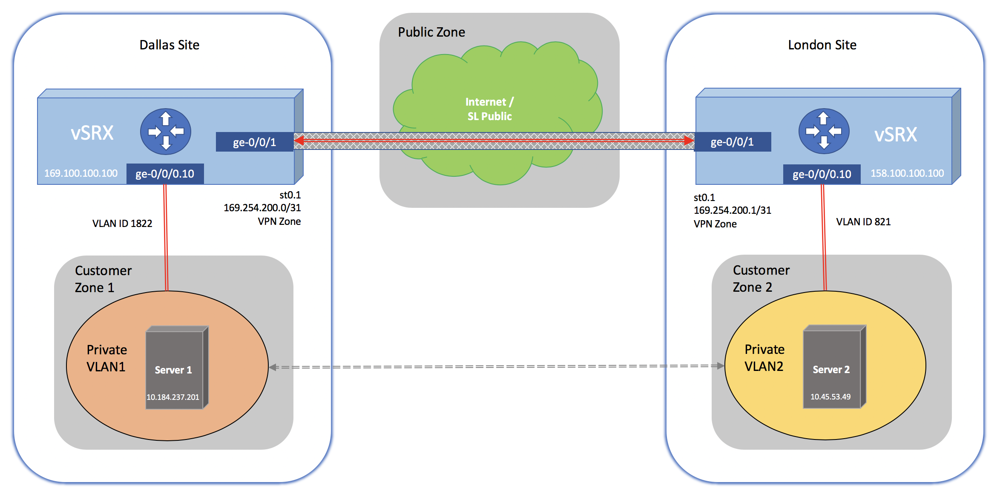

---

copyright:
  years: 2024
lastupdated: "2024-01-22"

keywords: working, vpn, sample, configuration

subcollection: vfsa

---

{{site.data.keyword.attribute-definition-list}}

# Working with VPN
{: #working-with-vpn}

This topic details a sample configuration for a route-based VPN between two sites. In this sample configuration Server 1 (Site A) can communicate with Server 2 (Site B), and each site utilizes two phase IPSEC authentication.
{: shortdesc}

{: caption="Site-to-site VPN" caption-side="bottom"}

## Sample configuration for Site A (Dallas):
{: #sample-configuration-for-site-a-dallas-}

```sh
# show security address-book global address Network-A
10.84.237.200/29;
[edit]
# show security address-book global address Network-B
10.45.53.48/29;
# show security ike
proposal IKE-PROP {
    authentication-method pre-shared-keys;
    dh-group group5;
    authentication-algorithm sha1;
    encryption-algorithm aes-128-cbc;
    lifetime-seconds 3600;
}
policy IKE-POL {
    mode main;
    proposals IKE-PROP;
    pre-shared-key ascii-text "$9$ewkMLNs2aikPdbkP5Q9CKM8"; ## SECRET-DATA
}
gateway IKE-GW {
    ike-policy IKE-POL;
    address 158.100.100.100;
    external-interface ge-0/0/1.0;
}
# show security ipsec
proposal IPSEC-PROP {
    protocol esp;
    authentication-algorithm hmac-sha1-96;
    encryption-algorithm aes-128-cbc;
    lifetime-seconds 3600;
}
policy IPSEC-POL {
    perfect-forward-secrecy {
        keys group5;
    }
    proposals IPSEC-PROP;
}
vpn IPSEC-VPN {
    bind-interface st0.1;
    vpn-monitor;
    ike {
        gateway IKE-GW;
        ipsec-policy IPSEC-POL;
    }
    establish-tunnels immediately;
}
# show interfaces
ge-0/0/0 {
    description PRIVATE_VLANs;
    flexible-vlan-tagging;
    native-vlan-id 1121;
    unit 0 {
        vlan-id 1121;
        family inet {
            address 10.184.108.158/26;
        }
    }
    unit 10 {
        vlan-id 1811;
        family inet {
            address 10.184.237.201/29;
        }
    }
    unit 20 {
        vlan-id 1812;
        family inet {
            address 10.185.48.9/29;
        }
    }
}
st0 {
    unit 1 {
        family inet {
            address 169.254.200.0/31;
        }
    }
# show security policies
from-zone CUSTOMER-PRIVATE to-zone VPN {
    policy Custprivate-to-VPN {
        match {
            source-address any;
            destination-address Network-B;
            application any;
        }
        then {
            permit;
        }
    }
}
from-zone VPN to-zone CUSTOMER-PRIVATE {
    policy VPN-to-Custprivate {
        match {
            source-address Network-B;
            destination-address any;
            application any;
        }
        then {
            permit;
        }
    }
```

## Sample configuration for Site B (London):
{: #sample-configuration-for-site-b-london-}

```sh
# show interfaces
ge-0/0/0 {
    description PRIVATE_VLANs;
    flexible-vlan-tagging;
    native-vlan-id 822;
    unit 0 {
        vlan-id 822;
        family inet {
            address 10.45.165.140/26;
        }
    }
    unit 10 {
        vlan-id 821;
        family inet {
            address 10.45.53.49/29;
        }
    }
}
st0 {
    unit 1 {
        family inet {
            address 169.254.200.1/31;
        }
    }
# show security ike
proposal IKE-PROP {
    authentication-method pre-shared-keys;
    dh-group group5;
    authentication-algorithm sha1;
    encryption-algorithm aes-128-cbc;
    lifetime-seconds 3600;
}
policy IKE-POL {
    mode main;
    proposals IKE-PROP;
    pre-shared-key ascii-text "$9$H.fz9A0hSe36SevW-dk.P"; ## SECRET-DATA
}
gateway IKE-GW {
    ike-policy IKE-POL;
    address 169.100.100.100;
    external-interface ge-0/0/1.0;
}
# show security ipsec
proposal IPSEC-PROP {
    protocol esp;
    authentication-algorithm hmac-sha1-96;
    encryption-algorithm aes-128-cbc;
    lifetime-seconds 3600;
}
policy IPSEC-POL {
    perfect-forward-secrecy {
        keys group5;
    }
    proposals IPSEC-PROP;
}
vpn IPSEC-VPN {
    bind-interface st0.1;
    vpn-monitor;
    ike {
        gateway IKE-GW;
        ipsec-policy IPSEC-POL;
    }
    establish-tunnels immediately;
}
# show security zone security-zone CUSTOMER_PRIVATE
security-zone CUSTOMER-PRIVATE {
    interfaces {
        ge-0/0/0.10 {
            host-inbound-traffic {
                system-services {
                    all;
                }
            }
        }
    }
}
security-zone VPN {
    interfaces {
        st0.1;
    }
}
# show security policies from-zone CUSTOMER-PRIVATE to-zone VPN
policy Custprivate-to-VPN {
    match {
        source-address any;
        destination-address Network-A;
        application any;
    }
    then {
        permit;
    }
}
 # show security zones security-zone VPN
interfaces {
    st0.1;
}
# show security policies from-zone VPN to-zone CUSTOMER-PRIVATE
policy VPN-to-Custprivate {
    match {
        source-address Network-A;
        destination-address any;
        application any;
    }
    then {
        permit;
    }
}
```

## Performance consideration
{: #performance-consideration}

To achieve the best IPSEC VPN performance, use AES-GCM as the encryption algorithm for both IKE and IPSEC proposals.

For example:

```sh
set security ike proposal IKE-PROP encryption-algorithm aes-128-gcm
set security ipsec proposal IPSEC-PROP encryption-algorithm aes-128-gcm
```

With AES-GCM as the encryption algorithm, you don't need to specify the authentication algorithm in the same proposal. AES-GCM provides both encryption and authentication.

## Additional VPN configurations
{: #additional-vpn-configurations}

To configure IPSec VPN, site to site, remote access VPN, and other features, refer to this [configuration guide](https://www.juniper.net/documentation/en_US/junos/information-products/pathway-pages/security/security-vpn-ipsec.pdf){: external} from Juniper.

For an example of how to configure a route-based site to site IPSec VPN, refer to this [configuration guide](https://www.juniper.net/documentation/en_US/junos/topics/example/ipsec-route-based-vpn-configuring.html){: external} from Juniper.
